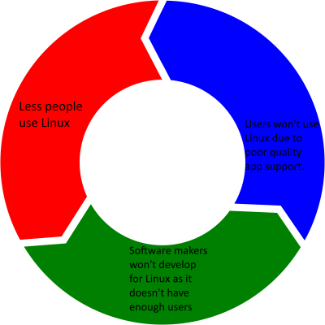


This article is over a year old.


Here's why.

<!--more-->

-------

Please don't rush in the comments and say "It's GNU+Linux by the way 🤓," **I KNOW**.

This is heavily inspired by Nicholas Fraser's [blog post](https://ludocode.com/blog/flatpak-is-not-the-future).

-----


This article is a rant. It is not super-well researched and may contain invalid points.


 

# My rant

## The story

On the evening of August 27th, 2023, I was putting the final touches on my Chris Titus blog post. I started the Hugo dev server to check the post over. I opened Dopamine 2 (my music player) at the same time. My PC (running Windows 11 pro, *ew*) did what Windows does best, and just froze. Of course, this had to happen now.

After forcefully rebooting it, I wondered to myself why I hadn't gone back to Linux, which never had this issue. Why was I using an OS made by underpaid developers using nothing but duct tape and dreams and owned by a megacorp seeking nothing but dollar signs? The answer was, well, because everybody else did.

## The problem

Here's my problem. Time and time again, I see lackluster, even abysmal software support for Linux. Proton (well it was *made* for games, so it gets a pass) and Wine focuses too much on games that app support stagnates. Sure, I could *pay for [Wine](https://winehq.org)* ([CrossOver](https://www.codeweavers.com/crossover)) or use [Bottles](https://usebottles.com/), but then I'm running *Windows* apps on Linux when those apps could be Linux-native. :(

So, now I'm asking myself, *Why do developers not want to support Linux, the best kernel/OS/thing ever made?* Then, it dawned on me. Linux. Is. Too. Complex. Now, hold on, don't stop reading, let me explain. I realized a few key problems with Linux really stop developers from caring.

See, Linux is so custom that most support tickets for apps that support Linux *come from Linux*, not from user stupidity or ignorance, but from issues resulting from the vast amount of possible configurations for desktop Linux. This is a *huge* deterrent. See, users spend so much time squabbling over what distro is the best, and then making yet *another* Ubuntu derivative, they fail to see the real problem. They use different distros, kernels, package managers, libraries, desktops and configs.

When you have so many different setups, it's hard for developers to support them all. We see this with PC ports using DirectX 11 instead of 12, [because 11 auto-magically handles different hardware specs and configs](https://www.youtube.com/watch?v=tF013HYQd2Q&t=311s). However, centralization is also bad, choice is *good*.

These bigger companies want a stable platform to develop for, and with all these choices, that's difficult.

### The options

Linux has a lot of ways to package software for it. Every distro is different, and then you have the universal formats. I'll try and explain why each one is flawed and isn't exactly appealing to developers.

#### Native Packages

This can mean a lot of things, depending on your distro. It could be DEB files, RPM files, zst-compressed package tarballs (Arch btw), APK packages (not Android), NIX packages, building from source, or many others. All these formats are different, and while some can be converted (ex. RPM -> DEB, DEB -> ZST) they're all unique and have to be compiled individually. That's too much work for developers, so distro maintainers handle the compilation of packages. Some distros might keep older versions of packages for the sake of stability, others might always be on the bleeding edge. Then there are also issues with conflicting dependencies or overwritten ones (aka dependency hell). This is not appealing because there's too much choice.

When distros compile packages things might be out of date, intentionally or not. This can cause issues, as you might have to wait for your favorite package to be updated. Native packages can also have dependency issues (it wants version 1.3, but 2.5 is all that's available) or *dependency hell* (it wants 1.3 but another app needs 2.5).

#### Snaps

My only memory with snaps is Firefox on Ubuntu, and that was the worst version of Firefox ever made. It took what felt like ages to start. Anyway, snaps are unique here because snaps can also be deployed on the server-side (kinda like Docker), but at that point, you could also use [Podman](https://podman.io) and you'd get better performance and [more security](https://www.redhat.com/en/topics/containers/what-is-podman#podman-vs-docker). Apparently, the reason they take so damn long to start is because they're extracting a `squashfs` image from disk. They clog up your mounts and lengthen your boot time (all snaps are mounted at boot). They also don't have a tool like Flatseal to manage the security sandbox and might give apps too many or too few permissions. These aren't great mainly with the slow start time, and low rates of adoption.

[Rudra Saraswat](https://about.ruds.io) did create an alternate snap server called [`lol`](https://gitlab.com/lol-snap), but I haven't heard much about that, seems to be deprecated.

#### Flatpaks

I think Nicholas Fraser did a great job explaining some of the issues with Flatpak in this [blog post](https://ludocode.com/blog/flatpak-is-not-the-future). To summarize:

- Flatpaks are big because they depend on "shared runtimes" that are distro-specific (there are Ubuntu 20.04 and 22.04 ones for example) and that anybody can make.

- Existing libraries post-2012 are quite backwards compatible, so this shared runtime system isn't exactly the best one.

- All the downloads mean you're basically downloading another OS on top of your existing one.

- This is a problem as built-in disk space has been shrinking.

- The security sandbox does not have a permission API like on [iOS](https://developer.apple.com/documentation/uikit/protecting_the_user_s_privacy/requesting_access_to_protected_resources) or [Android](https://developer.android.com/guide/topics/permissions/overview), as they want [Flatpak apps to not know they're flatpacked](https://ludocode.com/blog/flatpak-is-not-the-future)[^1], and is generally not well-enforced or too-well enforced, requiring the use of commands or [Flatseal](https://flathub.org/apps/com.github.tchx84.Flatseal). Apps cannot prompt the user to grant permissions they need, this is all manual.

- Other remotes can have packages with the same reverse DNS prefix, causing confusion.

- This is all so complex, nobody's going to be able to maintain this insanity.

Also, it seems that especially with snaps, a lot of these apps are actually community builds. That creates stability issues, what if it stops being maintained? How long will it take for updates?

#### Appimages

I mean, you still need [AppImageLauncher](https://github.com/TheAssassin/AppImageLauncher) for desktop integration, so it's not exactly portable and convenient at the same time. They get to choose what runtimes are included at compile time, which just makes things confusing. They're also big, as they contain all the runtimes the app needs. You get them from Appimagehub (why are there 2 of them?) or a downloads page. On the AUR, these are commonly extracted and converted to ZST packages, and work just fine using the system libraries. These are just not as convenient, and just as big.

#### Binary Tarball

Seriously? Nobody would bother manually making app menu entries for these. These aren't exactly apps that you *install*, and they still come with at least *some* libraries.

### Software Stores

There are 2 main software stores at play here, for the two most popular app containerization frameworks. [Snapcraft](https://snapcraft.io) and [Flathub](https://flathub.org). Snapcraft is run by Canonical, and Flathub seems to be run by [Freedesktop](https://www.freedesktop.org/wiki/) (I could be wrong). Both of these stores push centralization.

Centralization is *bad*. When something is centralized, it's easy for the owners to monetize it to make a quick buck. Flathub doesn't process payments *yet*, but they will soon enough, it's too lucrative. They'll start *milking* these stores for as much money as they can, we're all human.

> This is the real reason Ubuntu wants everyone to use Snap instead of helping us build apps that run natively on Ubuntu. This is also why they keep the Snap server source code closed. They want it to be “open” the way Android is “open”, where there is only one official store and sideloading apps is as annoying as possible.
>
> *-Nicholas Fraser ([ludocode.com](https://ludocode.com/blog/flatpak-is-not-the-future))*

Even Windows does better than this, with its MSI and EXE installers, which are also flawed. When *Windows* of all things is better than your system, you know your system is fucked up.

### Different display and app frameworks

So, let's say I want to make an app for desktop Linux. I have some choices. To make the app, I can make a site and use Electron or Tauri, or I can go full native and use GTK3, GTK4, libadwaita, QT 5 or QT 6. Then the app might be running on either [X11](https://x.org) (suuuper ancient, has less issues) or [Wayland](https://wayland.freedesktop.org) (more modern, but has issues). Compatibility layers like [Xwayland](https://wayland.freedesktop.org/xserver.html) help, but they aren't perfect.

This means it's difficult to fully support everything, and a lot of games don't work on Wayland for everybody, for example. X11 has horrible tearing for some people who use multiple monitors (ancient software moment).

This provides more work for developers to migrate, but most choose not to. This makes Linux even less stable.

### Users

So it seems that Linux users *love* to argue about their favourite distro, DE, display server, or app framework. Alongside that, developers love to make a new Ubuntu-based distro every week, creating *more* useless choices.

The developers of these frameworks might not bicker and might have gotten their act together, but users haven't. They think 2% is some kind of huge milestone. It's a great one no doubt, but the other 98% don't give a shit.

To prove my point further, here's a quote:

> Attracting \[big companies\] will only happen by empowering them with a stable platform, not locking them in a box.
>
> *- Nicholas Fraser ([ludocode.com](https://ludocode.com/blog/flatpak-is-not-the-future))*

This is *not* a stable platform. This is hell. Choice is good, but at what point does it become too much?

## Why I'm on Windows

I don't like Windows. I despise it. I'm currently running Windows 11 Pro 22H2 and it's slow as ever :).

I'm stuck on this piece of hot ass held together with duct tape and dreams because I feel Linux just doesn't have good enough app support and is too unappealing to most developers. Linux users are squabbling over containerized formats that don't work well in their current state and *need fixing*, while Microsoft keeps adding more bloatware and tracking to Windows. 

We're *still* trying to transition our displays from a piece of software made in 1984, *39 years ago*, called the [X windowing system](https://x.org). [Wayland](https://wayland.freedesktop.org/) is the future and all, but it has caused a rift between users as to what display server they use, which causes more problems. Xwayland *works*, and is getting better all the time ([Xwayland video bridge](https://invent.kde.org/system/xwaylandvideobridge) my beloved), but still needs work. The only things it is for are the portal system, less tearing, better composition ([no server/client framework](https://wayland.freedesktop.org/architecture.html)), and being able to run Android 12 ([Waydroid](https://waydro.id)). Other than that, most apps still use X11. 

We also have different audio servers. They *should* all be somewhat interoperable. but the differences are still there. Pulseaudio is quite common, but [Pipewire](https://pipewire.org/) also exists.

People develop for Windows because it's popular. I just can't avoid that. That's why I use Windows.

## The solution?

This is hard to fix. Nobody is going to throw away all their hard work to come together. We can just hope that people realize that some form of consolidation is needed to compete with Windows or to simply expand. We need to fix all these broken technologies for desktop Linux to truly shine as a beacon of freedom from Big Tech surveillance.

I heard someone call distros like Arch, Debian, Ubuntu and Slackware "grandaddy distros." Eventually, everybody comes back to them. I find that interesting, as it could be part of the solution to our problem.

Wine is *okay*, and with tools like Bottles or Proton, it gets better all the time, but it isn't perfect. If people could get their act together we could make development for Linux easier, and then people would see a reason to use Linux. However, there is an intriguing paradox afoot:

This *seems* unrelated, but I find our current system isn't exactly helping this.

I don't even know for sure how we'd even break this cycle. People *do* use Linux regardless, that's where the 2% comes from, but I'm talking about *average users*. We need to break this cycle created by this scaffolding clusterfuck of infrastructure we've built.

## Conclusion

I've ranted on and on about this, and I still feel I might have glossed over something, but I hope this gives you some idea of why Linux has a problem.

To summarize, Linux has so many possible choices for everything that developers don't want to even begin to support it all. This means packaging is left to distributions and the community, who make unofficial snaps and flatpaks. Developers have begun to properly support flatpaks and snaps, but they have issues. Software stores are in it to make a quick buck from users because they're the *only* source of these bloated UPFs.[^2]

Linux users keep bragging about desktop configs or developers are making another fucking Ubuntu derivative. People fail to realize we have a serious problem with this clusterfuck, and it is stopping Linux from being what it should be, a beacon of freedom. It doesn't have to eclipse Windows, it just has to be better and stable.

Linux is great. It can get better. These tools can improve. Linux can be *the* OS for those who care about their privacy and freedom.

So, let's make it happen.

Until then, I'll stick with Windows.

*- Asterisk*

-------

*Cover image taken from [FossBytes](https://fossbytes.com/).*

[^1]: It's under the header "Permissions And Portals" by the way.
[^2]: **U**niversal **P**ackaging **F**ormat.